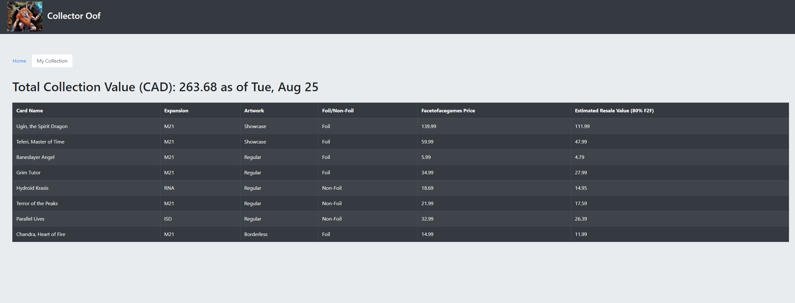

# collector-oof
Price tracker for Magic the Gathering cards

## Purpose
This web application fetches card prices from facetotfacegames.com according to card name, expansion, and condition and displays them on a table.
The app also calculates the estimated resale value of each card and shows the total resale value of your card collection.

## Sample Screenshot

## Future Plans
* Sorting table based on card name, expansion, or price
* CSV Upload
* Reduce loading time for querying data
* Card image hover
* Adding or removing card information from the front-end
